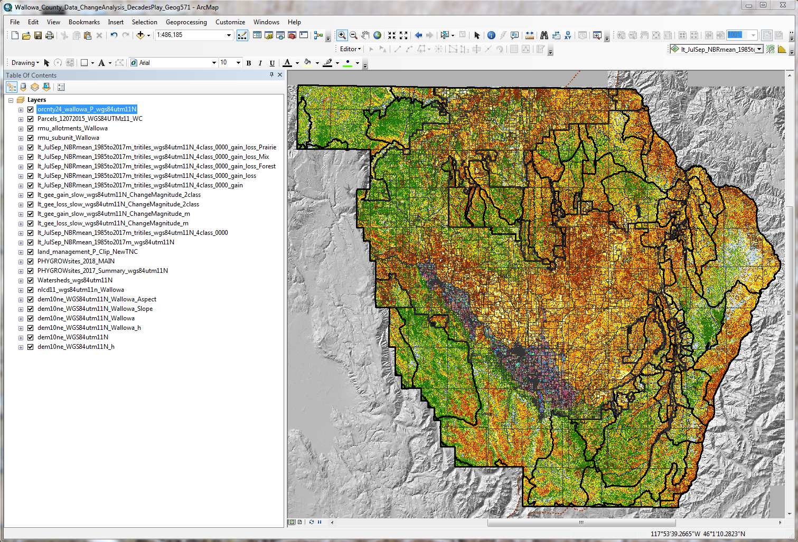

#The Wallowa County Rangeland Assessment and Monitoring System (WC-RAMS)#
##Project Proposal:

> The goal of my PhD research is to create a Rangeland Assessment and Monitoring System for Wallowa County, Oregon: the WC-RAMS.  For Geog571, I propose that I create a web map that will be the “landing pad” (or at least a feature) for the website I need to create for the WC-RAMS that presents research to my collaborators, the Wallowa County community, and anyone else interested.  It will focus on the county’s general geography to orient the visitor, but then provide access to a series of data layers that “tell the story” of land use and resource management, both in the county and the greater region.  The data presentation will culminate by highlighting some products from the two computer models that comprise the core of the WC-RAMS, LandTrendr and PHYGROW/LEWS.  In addition to web served basemaps and vector layers to display basic information, I have a suite of shapefiles detailing management and property ownership in the county (that I’ll convert) to augment and help explain the habitat change trend data and biomass forecasts from the models.

##Data Sources
**Note:** I have multiple datasets that I've developed for basic geographic features (roads, lakes, rivers/streams, etc.) that I can use if needed, but I ought to be able to take care of these baseline data considerations through Mapbox.
Name|Description|Url Link|Notes
----|-----------|--------|-----
wallowa-base|Mapbox Basemap|TBD|Lab 4 Product
dem10ne|National Elevation Dataset (NED): DEM|https://www.oregon.gov/geo/pages/sdlibrary.aspx|Original Dataset
dem10ne_WGS84utm11N|NED: DEM product|NA|Reprojected
dem10ne_WGS84utm11N_h|NED: DEM product|N/A|Hillshade
dem10ne_WGS84utm11N_Wallowa|NED:DEM product|N/A|Reprojected, Wallowa Subset
dem10ne_WGS84utm11N_Wallowa_h|NED: DEM product|N/A|Hillshade, Wallowa Subset
dem10ne_WGS84utm11N_Wallowa_Slope|NED: DEM product|N/A|9 Slope Classes
dem10ne_WGS84utm11N_Wallowa_Aspect|NED: DEM product|N/A|10 Aspect Classes
nlcd11_wgs84utm11n_Wallowa|NLCD Data|https://catalog.data.gov/dataset/usgs-national-land-cover-dataset-nlcd-downloadable-data-collection| Wallowa Subset
Watersheds_wgs84utm11N|Josepsh Cr. and Imbnaha R. Watersheds|N/A|KRH dataset
PHYGROWsites_2017_Summary_wgs84utm11N|2017 Field Survey|N/A|KRH dataset
PHYGROWsites_2018_MAIN|2018 Field Survey|N/A|KRH dataset
land_management_P_Clip_NewTNC|Fed Govt Land Ownership|<http://www.gis.state.or.us/data/shapefile/k100/land_management.zip>|Wallowa Subset, Edited with New information
lt_JulSep_NBRmean_1985to2017m_wgs84utm11N|Earth Engine Product|N/A|Normalized Burn Ratio
lt_JulSep_NBRmean_1985to2017m_tritiles_wgs84utm11N_4class_0000|Earth Engine Product|N/A|NBR Habitat Classes
lt_gee_loss_slow_wgs84utm11N_ChangeMagnitude_m|Earth Engine Product|N/A|LT long term NBR loss > 4yr
lt_gee_gain_slow_wgs84utm11N_ChangeMagnitude_m|Earth Engine Product|N/A|LT long term NBR gain > 4yr
lt_gee_loss_slow_wgs84utm11N_ChangeMagnitude_2class|Earth Engine Product|N/A|LT long term NBR loss > 4yr, Classified
lt_gee_gain_slow_wgs84utm11N_ChangeMagnitude_2class|Earth Engine Product|N/A|LT long term NBR gain > 4yr, Classified
lt_JulSep_NBRmean_1985to2017m_tritiles_wgs84utm11N_4class_0000_gain|Earth Engine Product|N/A|Raster Math product, gain by habitat
lt_JulSep_NBRmean_1985to2017m_tritiles_wgs84utm11N_4class_0000_gain_loss|Earth Engine Product|N/A|Raster Math product, gain/loss by habitat
lt_JulSep_NBRmean_1985to2017m_tritiles_wgs84utm11N_4class_0000_gain_loss_Forest|Earth Engine Product|N/A|Raster Math product, gain/loss in Forest Habitats
lt_JulSep_NBRmean_1985to2017m_tritiles_wgs84utm11N_4class_0000_gain_loss_Mix|Earth Engine Product|N/A|Raster Math product, gain/loss in Forest/Prairie Transition Habitats
lt_JulSep_NBRmean_1985to2017m_tritiles_wgs84utm11N_4class_0000_gain_loss_Prairie|Earth Engine Product|N/A|Raster Math product, gain/loss in Prairie Habitats
rmu_allotments_Wallowa|USFS Grazing Alltoments|https://data.fs.usda.gov/geodata/ |Wallowa Subset
rmu_subunit_Wallowa|USFS Grazing Alltoments, Patures and Exclosures|https://data.fs.usda.gov/geodata/ |Wallowa Subset
Parcels_12072015_WGS84UTMz11_WC|Tax Lot Data|https://www.oregon.gov/geo/pages/sdlibrary.aspx| Wallowa Subset
orcnty24_wallowa_P_wgs84utm11N|County Boundary|Wallowa County Boundary|https://www.arcgis.com/home/item.html?id=170b74b3e15d49f59aa56ae51939542b| Wallowa Subset

**Note:** I realize this is lots of datasets, but I consider all potentially very useful in "telling the story" of land management in Wallowa county. They will all need to be converted to WGS1984 (now projected in WGS84, UTM 11N).

##Graphic Display of Datasets
It all looks very messy displayed at once, but I'm hoping to provide a series of data layers that the user can be turned off and on to explore data and data products.

